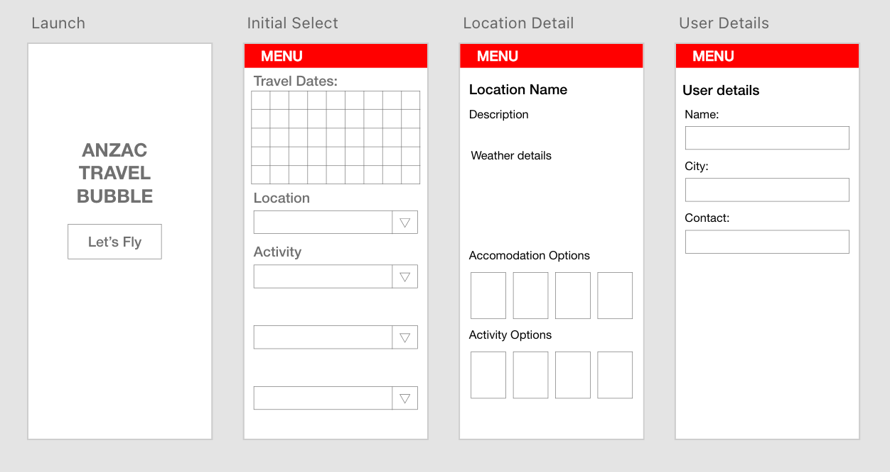
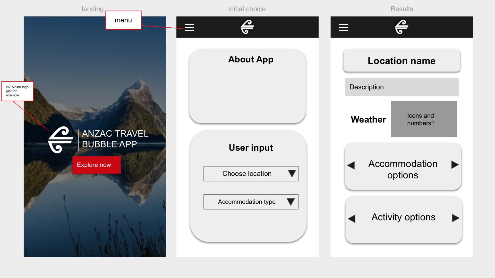
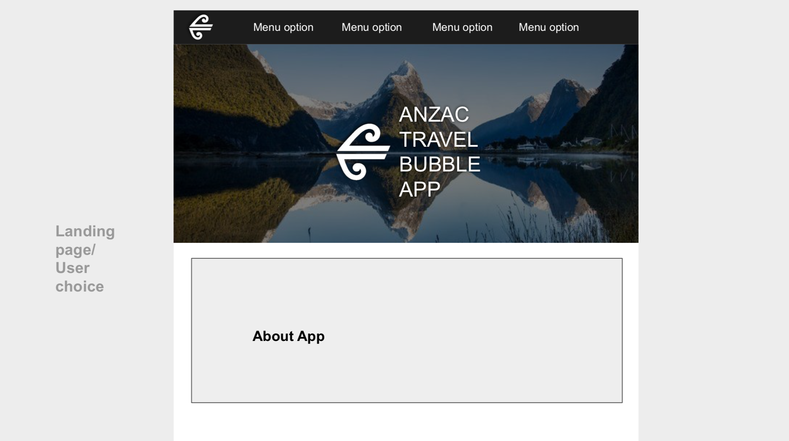
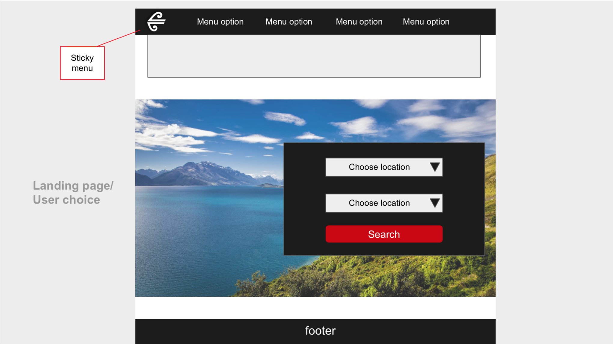
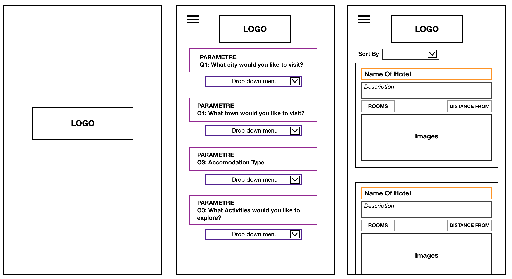

# The-ANZAC-Bubble-Travel-App

## Deployment
[https://mrsamlaw.github.io/07-ANZAC-Bubble-Travel-App/](https://mrsamlaw.github.io/07-ANZAC-Bubble-Travel-App/)

## Technologies
- HTML
- CSS
- Twitter Bootstrap
- JavaScript
- JQuery
- JQuery UI
- Moment JS
- Hotel API by APIDojo (https://rapidapi.com/apidojo/api/hotels4)
- OpenWeather API (https://openweathermap.org/api)

## Description
The ANZAC Bubble Travel App is a dynamic, user friendly, and convenient travel and accomodation finder for Australians that are keen to visit our New Zealand neighbours! The application provides each user with the option to search by a range of categories, including the prefered city they'd like to explore, the price range of their choosing and the number of adults traveling. Additionally, the app provides the keen traveller with the current weekly weather forecast of their chosen city, displaying a brief description, temperature reading, the average wind speed, humidity percentage and a icon for the day.

## Screenshots
Landing and selection page

.gif)

Available accomodation

.gif)

Responsive aspects

.gif)

## Wireframes
Initial Wireframes:

## The Team
### [Sam Law](https://github.com/MrSamLaw) 

### [Carly Jackson](https://github.com/caarlyjackson)

### [Tim Rabbidge](https://github.com/TBR2000)

### [Ushante Lancaster](https://github.com/subwayaintfresh)
